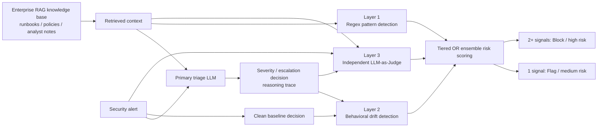

# Enterprise RAG security の3層防御アーキテクチャ

## 概要

SOC トリアージを支援する RAG 型 LLM の判断について、取得コンテキスト、
clean 条件との差分、推論整合性を別々に監視し、ensemble risk scoring により
flag または block を判断する runtime 防御構成である。

## 事実

- Layer 1 は Tensor Trust の成功した prompt injection attacks の分析から抽出した94個の regex pattern を用い、既知の injection techniques を sub-millisecond で検査する。Section 2.1、p.12。
- Layer 2 は clean context における baseline decision と potentially poisoned context における decision を比較し、severity downgrade または escalation suppression を検知する。Section 2.2、pp.12-13。
- Layer 3 は別の LLM instance が alert、retrieved context、primary model reasoning trace を受け取り、reasoning integrity を判定する。Section 2.3、p.13。
- risk-scoring engine は tiered OR logic により、1層の発火で flag、2層以上で block とする。Section 2.5、p.14; Appendix A.2、p.25。
- 初期の weighted-average scoring `0.25L1 + 0.45L2 + 0.30L3` は recall `20%` に留まり、OR logic への切替後に ensemble recall `90%` が報告された。Section 6.2.1、pp.23-24。

## システムアーキテクチャ

Sections 2.1-2.5 と Appendix A.2（pp.12-14, 25）を基にした機能フローの再表現である。

## 実装構成

| 要素          | 機能                                             | 評価結果または記載                                                  |
| ----------- | ---------------------------------------------- | ---------------------------------------------------------- |
| Regex layer | known poison / prompt injection patterns の早期検査 | detection `58.6%`、平均 `0.14 ms`、Table 5.1、p.19              |
| Drift layer | clean と poisoned の decision change 検知          | drift `24.8% (62/250)`、Tables 5.2-5.3、pp.19-20             |
| Judge layer | reasoning integrity の別モデル評価                    | precision `97.4%`、recall `76.0%`、F1 `85.4%`、Table 5.4、p.21 |
| Ensemble    | flag / block の runtime decision                | precision `95.7%`、recall `90.0%`、F1 `92.8%`、Table 5.4、p.21 |
| Gateway     | トリアージ pipeline への inline integration           | FastAPI integration gateway、Section 4.1、p.17               |

## SOC workflow と NIST AI RMF

### 事実

- システムは LLM security triage decisions を real time に monitor and validate する gateway として記述される。Section 4.1、p.17。
- 著者は NIST AI RMF の monitoring、risk response、incident tracking に関連する control との alignment を意図すると述べる。Section 3.3、p.16。

### 解釈

- SOC 運用では `flag` を analyst review の優先付けへ、`block` を自動 escalation 抑制の防止へ接続する設計が考えられるが、具体的な運用効果は本論文で比較評価されていない。

## 解釈

- この構成の特徴は、コンテキストの表面パターンだけでなく、判断変化と説明整合性を独立信号として扱う点にある。
- RAG や GraphRAG の取得層を production 判断へ接続する場合、同様の defense-in-depth は provenance 検査などの追加層と組み合わせて検討できるが、本論文の評価範囲を越える。

## 未解決課題

- [[questions/is_llm_as_judge_reliable|CoT poisoning 検知に LLM-as-Judge は信頼できるか]]
- cached baseline が最新 policy と整合することをどう保証するか。
- NIST AI RMF alignment を SOC audit evidence として評価する手順は何か。

## 関連ページ

- [[papers/cot_poisoning_enterprise_rag|Detecting Chain-of-Thought Poisoning in Enterprise LLM Applications]]
- [[concepts/chain_of_thought_poisoning|Chain-of-Thought poisoning]]
- [[concepts/behavioral_drift_detection|Behavioral drift detection]]
- [[concepts/llm_as_judge|LLM-as-Judge]]
- [[concepts/rag_security|RAG security]]
- [[themes/enterprise_rag_security|Enterprise RAG の推論汚染検知と運用ガバナンス]]

## 矛盾

- Layer 1 は当初の単独 detection target に達しなかったが、論文は ensemble 設計の中で許容している。単独防御として十分であるとは扱わない。
- LLM-as-Judge は独立層とされるが、評価ラベル生成は Layer 2 に依存する。

## 情報源

- `raw/papers/DetectingChainofThoughtPoisoninginLLMEnterpriseSystems.pdf` - Sections 2.1-2.5、3.3、4.1、5.1-5.5、6.1-6.2、Appendix A.2、pp.12-25。
