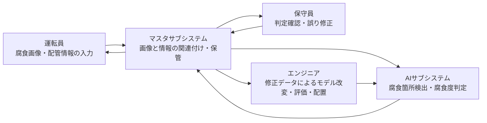

# HITL ML 運用・開発連携アーキテクチャ

## 概要

AI 腐食診断システムにおいて、画像と設備情報の保管、機械学習モデルによる判定、
保守員による修正、エンジニアによる再学習・モデル差替えを一つの運用・開発連携
プロセスとして定義したアーキテクチャである。

## 事実

- 著者らは、対象システムの機能として「画像に基づく腐食の自動検出」「画像と関連情報のリンク」「修正結果に基づく機械学習モデルの再学習」を定義する。図4、p.27。
- AI 腐食診断システムは、モデルの管理・実行を担う `AI サブシステム` と、データ管理を担う `マスタサブシステム` に分解される。図6、p.28。
- 運転員は腐食画像と配管情報を送信し、保守員は判定結果を確認して誤りを修正する。図5-8、pp.28-30。
- AI サブシステムでは、修正データに基づきエンジニアがモデルを改変し、改変モデルを評価して配置する。図8、p.29。
- 機械学習モデルには、腐食画像でファインチューニングした YOLOv7 が用いられた。p.30。

## システムアーキテクチャ

図7-8（pp.28-30）の本文説明に基づく整理であり、図形の再現ではなく機能フローの
Markdown 表現である。

## 実装構成

| 構成要素 | 機能 | 根拠 |
| --- | --- | --- |
| AI サブシステム | モデルによる推論、判定データ評価、モデル向上 | 図6-8、pp.28-30 |
| マスタサブシステム | 画像・設備情報・判定結果・修正データの関連付けと保管 | 図6-8、pp.28-30 |
| 機械学習モデル | 画像内の腐食箇所を矩形検出し、進行度を判定 | 4.1 節、p.30 |
| モデル基盤 | YOLOv7 を腐食画像でファインチューニング | p.30 |
| 人間の確認系 | 保守員が誤判定を修正し、運転員が判定結果を確認 | 図5-8、pp.28-30 |
| 開発連携 | エンジニアが修正データを用いてモデルを改変・評価・配置 | 図8、p.29 |

## 運用フロー

| 段階 | 処理 | 主体 |
| --- | --- | --- |
| データ取得 | 腐食画像と配管情報を入力する | 運転員 |
| 保管 | 画像と情報を関連付けて保管する | マスタサブシステム |
| 推論 | 腐食箇所と進行度を判定する | AI サブシステム |
| 人間確認 | 判定結果を確認し、誤りを修正する | 保守員 |
| 修正蓄積 | 修正データを保管する | マスタサブシステム |
| モデル更新 | 修正データでモデルを改変・評価・配置する | エンジニア、AI サブシステム |

## MLOps との関係

### 事実

- 論文本文は `MLOps` という用語を用いていない。
- 論文のアーキテクチャには、運用データの保管、修正データの蓄積、モデルの再学習、評価、配置という開発・運用連携の処理が含まれる。3.2 節、pp.29-30。

### 解釈

- MLOps との対応付けや比較は、この資料だけでは検証されていないため、別資料による比較課題として残す。

## 解釈

- このアーキテクチャは、人間の判断を単なる例外対応ではなく、修正データとモデル更新に接続するシステム要素として明示する点に特徴がある。
- モデルの再学習効果が確認されなかったことから、アーキテクチャの評価では、業務効率化とモデル改善を分けて測る必要がある。

## 未解決課題

- [[questions/hitl-ml-open-problems|HITL ML の運用データと再学習をどう評価するか]]

## 関連ページ

- [[concepts/human_in_the_loop_ml|Human in the Loop Machine Learning]]
- [[papers/shimbo-2024-hitl-ml-system-architecture|HITL ML の運用のためのシステムアーキテクチャの定義と実践]]
- [[themes/hitl-industrial-inspection-operation-evaluation|HITL 産業検査における運用データと再学習の評価]]

## 矛盾

- アーキテクチャは修正結果を再学習へ接続するが、本事例で報告された `110` 件の不一致による再学習では精度改善が確認されなかった。p.33。

## 情報源

- `raw/papers/human_in_the_loop_ml_system_architecture_2024.pdf` - 図3-10、3.1-4.3 節、pp.27-35。
