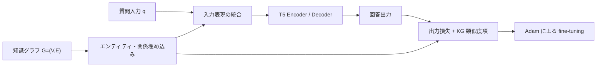

# T5 知識グラフ fine-tuning アーキテクチャ

## 概要

質問入力と、知識グラフ由来のエンティティ・関係埋め込みを統合して T5 に与え、
出力損失と知識グラフ関連の補助項で fine-tuning する構成である。

## 事実

- 論文は、知識グラフ `G=(V,E)` のエンティティと関係を埋め込みベクトルとして表し、入力テキストと統合する構成を図1に示す。2.2-2.3 節、図1、p.2。
- 入力表現は、質問 `q` に関連エンティティベクトル `v_i` と関係ベクトル `e_j` を加えた形で説明され、これらが共同で T5 エンコーダに処理される。2.3 節、pp.2-3。
- 損失関数は、T5 の出力損失に知識グラフ埋め込みの類似度を用いた項を加える形で記載される。2.4 節、p.3。
- 学習には Adam、Dropout、正則化を利用すると記載される。2.4 節、p.3。

## システムアーキテクチャ

図1および2.2-2.4節（pp.2-3）の説明を機能フローとして整理したものであり、
論文の図形をそのまま再現するものではない。

## 実装構成

| 構成要素 | 役割 | 根拠 |
| --- | --- | --- |
| T5 | 統合入力を処理し回答を生成する基盤モデル | 2.1、2.3 節、pp.2-3 |
| 知識グラフ `G=(V,E)` | 外部知識のエンティティと関係を保持する | 2.2 節、p.2 |
| KG 埋め込み | エンティティ・関係をベクトル表現として入力へ渡す | 2.2-2.3 節、pp.2-3 |
| 統合入力 | 質問と関連埋め込みを共同でエンコーダに入力する | 2.3 節、pp.2-3 |
| 補助損失項 | 埋め込みの類似度を学習目的に追加する | 2.4 節、p.3 |

## 解釈

- 本アーキテクチャの検証可能性には、関連エンティティ・関係の抽出または選択手順を再現できることが重要である。
- 論文の図と式は構成の概略を示すが、知識グラフ作成から質問への対応付けまでの実装パイプライン全体を確定する記述ではない。

## 未解決課題

- [[questions/kg-finetuning-evaluation-reproducibility|知識グラフ強化 T5 の性能改善を再現可能に評価できるか]]

## 関連ページ

- [[papers/t5-knowledge-graph-finetuning-complex-tasks-2025|A Fine-Tuning Approach for T5 Using Knowledge Graphs to Address Complex Tasks]]
- [[concepts/t5-knowledge-graph-finetuning|知識グラフを用いた T5 fine-tuning]]
- [[comparisons/t5-vs-t5-kg-finetuning|T5 と知識グラフ併用 T5 の比較]]

## 矛盾

- 著者らは外部知識の統合方式を図示する一方、使用した知識グラフ、関連要素選定、埋め込みモデルの具体的構成を本文で明示していないため、再実装に必要な仕様は不足している。

## 情報源

- `raw/papers/t5_knowledge_graph_finetuning_complex_tasks_2025.pdf` - 2 節、図1、pp.2-3。
